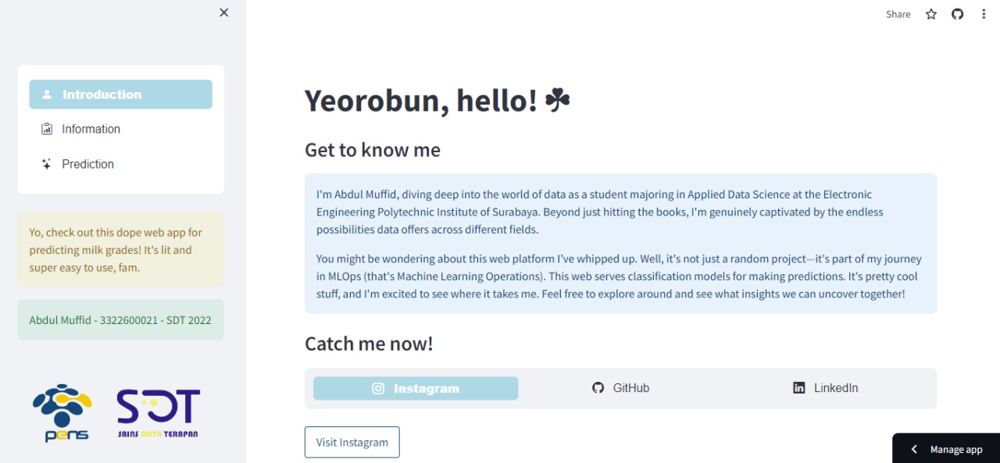
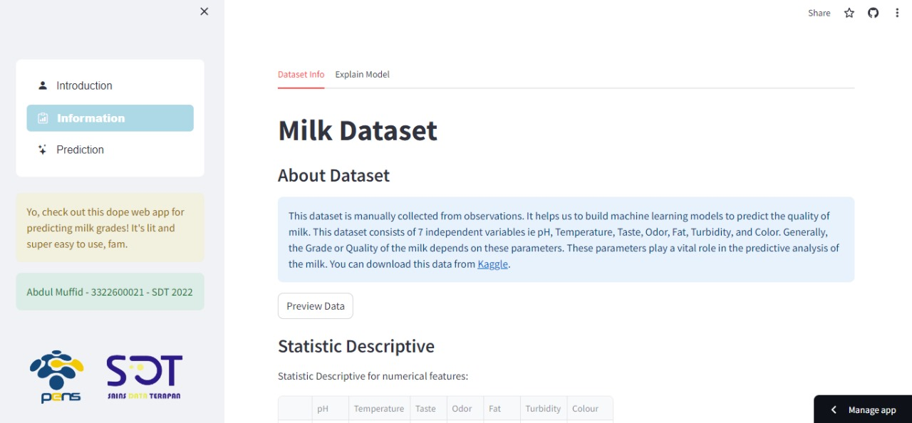
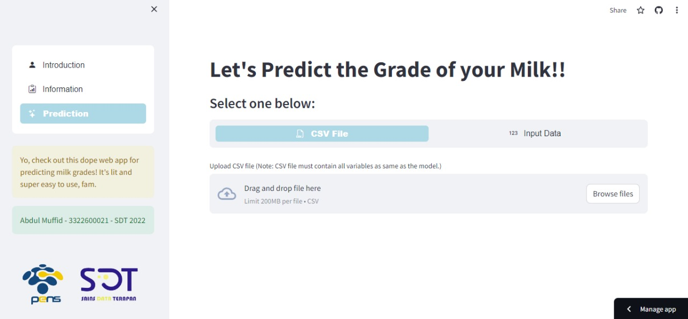

# Milk Grades Prediction   [](https://milk-grades-prediction.streamlit.app/)

## About the Project

### Description
This project hosts a Machine Learning Operations (ML-Ops) project aimed at creating a simple web application to predict milk grades using Streamlit, a popular Python library for building interactive web applications. The project leverages a Random Forest Classifier model, enhanced with PyCaret, a low-code machine learning library, to predict the quality grades of milk based on various factors such as pH, Temperature, Taste, Odor, Fat, Turbidity, and Color.

### Preview





## Getting Started

To get a local copy up and running follow these simple example steps.

### Prerequisites

This is an example of how to list things you need to use the software and how to install them.

1. Python

    * For Windows OS
        ```sh
        python --version 
        ```

    * For Unix Based OS (Linux, MacOS, etc)
        ```sh
        python3 --version 
        ```
    > Note: If you don't have python installed, you can download it [here](https://www.python.org/downloads/).

 2. Git
    
    ```sh
    git --version 
    ```
    > Note: If you don't have git installed, you can download it [here](https://git-scm.com/downloads).

### Installation

1. Clone the repository

    ```sh
    git clone https://github.com/abdmuffid/Streamlit-Simple-Web-to-Predict-Milk-Grades.git
    ```

2. Navigate to the project directory:

    ```sh
    cd Streamlit-Simple-Web-to-Predict-Milk-Grades
    ```

3. Create python environment
  
    ```sh
    python -m venv env
    ```

4. Activate python environment

    * For Windows OS
      ```sh
      env\Scripts\activate
      ```

    * For Unix Based OS (Linux, MacOS, etc)
      ```sh
      source env/bin/activate
      ```

5. Install the dependencies

    ```sh
    pip install -r requirements.txt
    ```

6. Run the Streamlit app

    ```python
    streamlit run streamlit_app.py
    ```

## License

Distributed under the MIT License. See [LICENSE](https://github.com/abdmuffid/Streamlit-Simple-Web-to-Predict-Milk-Grades/blob/main/LICENSE) for more information.

## Acknowledgements

* [Abdul Muffid](https://github.com/abdmuffid/)
